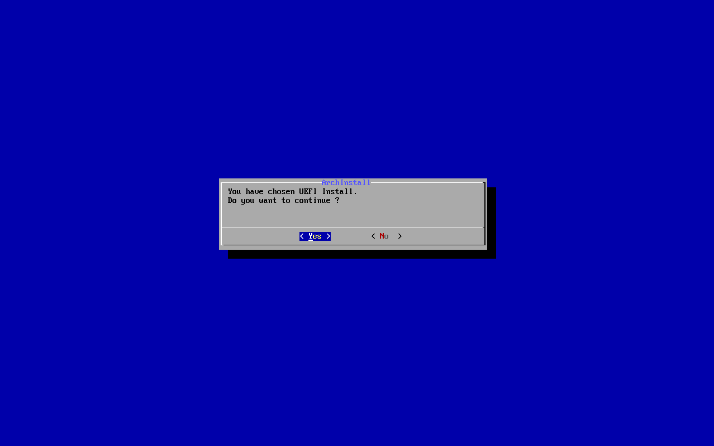

# ArchInstall

Minimal Arch Linux ISO with CLI-based installation and post-installation scripts, using `dialog` for a simple text-based UI.  
All installation scripts are written in Bash.

## Features

- **Language**: French by default  
- **Network configuration**: Wi-Fi (iwd) / Ethernet (Static or DHCP)  
- **Disk setup**: Partitioning and LUKS encryption  

## Installation

### Partition layout (Example for 64Go disk)
    

- Base system installation
- grub installation and configuration

### Post-installation

- Package installation (git, cron, wget, lynx, python3, go, sudo, openssh...)
- Creation of `localadm` and `rescue` users
- Add main user without sudo rights
- Sudo configuration
- Installation of `yay` (AUR helper)
- `/boot` mounted as `noauto` with pacman warnings (avoids accidental writes to umount `/boot` while updating)

### Gui setup

Install and configure GUI environment if selected

- **Gnome** basic install with GDM
- **Hyprland** Proposed config based on [Hyprland config](https://github.com/cei35/Hyprland) (with SDDM)
- **Xfce4** Proposed config based on [Xfce4 config](https://github.com/cei35/Xfce4) (with lightdm)

## TODO

- Automate SSH setup  
- Integrate AppArmor and Firejail  
- Harden GRUB configuration
- Installation with GUI (possibly as a separate ISO)
- Add MBR install
