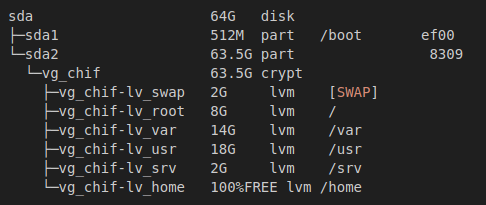

# ArchInstall

Minimal Arch Linux ISO with CLI-based installation and post-installation scripts, using `dialog` for a simple text-based UI.  
All installation scripts are written in Bash.

## Features

- **Language**: French by default  
- **Network configuration**: Wi-Fi / Ethernet (Static or DHCP)  
- **Disk setup**: Partitioning and LUKS encryption  

### Partition layout (Example for 64Go disk)
    

- Base system installation  
- Post-installation steps  
- Package installation  
- Creation of `localadm` and `rescue` users  
- Sudo configuration  
- Installation of `yay` (AUR helper)  
- `/boot` mounted as `noauto` with pacman warnings (avoids accidental writes to `/boot`)  

## TODO

- Automate SSH setup  
- Integrate AppArmor and Firejail  
- Harden GRUB configuration
- Installation with GUI (possibly as a separate ISO)
- Add MBR install
