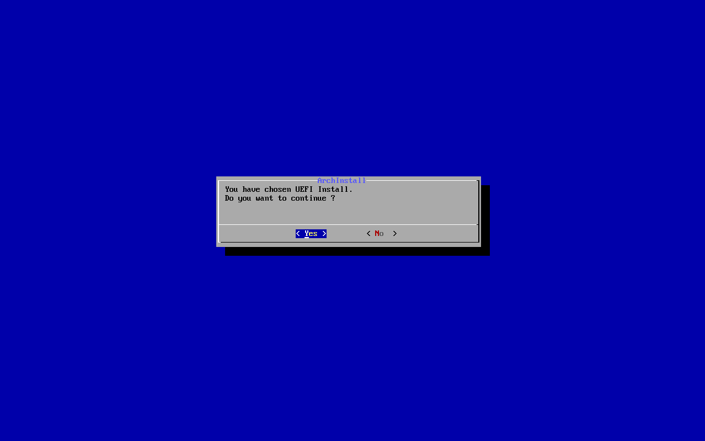
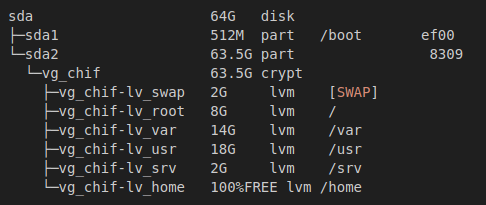

# ArchInstall

Minimal Arch Linux ISO with CLI-based installation and post-installation scripts, using `dialog` for a simple text-based UI.  
All installation scripts are written in Bash.

## Features

- **Language**: French by default  
- **Network configuration**: Wi-Fi (iwd) / Ethernet (Static or DHCP)  
- **Disk setup**: Partitioning and LUKS encryption  

## Installation

### Partition layout (Example for 64Go disk)
    

- Base system installation
- grub installation and configuration

### Post-installation

- Package installation (git, cron, wget, lynx, python3, go, sudo, openssh...)
- Creation of `localadm` and `rescue` users with their own bashrc/vimrc files
- Add main user without sudo rights
- Sudo configuration
- Installation of `yay` (AUR helper)
- `/boot` mounted as `noauto` with pacman warnings (avoids accidental writes to umount `/boot` while updating)

### Gui setup

Install and configure GUI environment if selected

- **Gnome** basic install with GDM
- **Hyprland** Proposed config based on [Hyprland config](https://github.com/cei35/Hyprland) (with SDDM)
- **Xfce4** Proposed config based on [Xfce4 config](https://github.com/cei35/Xfce4) (with lightdm)

### Additionnal Setup

- **Firejail:** Sandboxing tool installation with custom globals.local and automated Pacman hooks for all binaries.
- **MFA for localadm:** Adds Google Authenticator (2FA) requirement for su and lightdm to secure the administrator account.
- **Grub Security:** Add a password to the bootloader to prevent unauthorized editing of kernel parameters at startup.
- **Grub Background:** Customizes the GRUB boot menu with a dedicated background image.
- **Auditd:** Kernel-level auditing for security monitoring.

### Plymouth
Added a simple configuration for **Plymouth** using the same background as Grub.
- When you are prompted to enter your password, the following message appears (at the bottom of the screen): __"Enter disk password."__
- When you start typing, the following message appears: __"Typing Password..."__
- If the message __"Enter disk password."__ reappears, it indicates that you have entered an incorrect password.

#### Next One ~ TODOs

- SSH Server
- Apparmor
- SELinux
- Hardened Malloc
- Add Secure boot config to Grub Security
